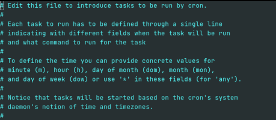

## h3-cli: How to schedule recurring pentests using h3-cli and cron

You can wire up h3-cli to a job scheduler (eg. cron) in order to run pentests on a recurring basis,
for example once a week or once a month. This guide shows you how to configure **cron** to automatically kick off a pentest once a week.

cron is just one of many job scheduling services you could use for this purpose.  Any service is
compatible with this guide as long as you can invoke h3-cli from it.

**IMPORTANT:**  If you're running _internal_ pentests, you have to download and run NodeZero 
as part of the cron job.  This means h3-cli must be 
installed and executed on the machine where you intend to run NodeZero.


[[_TOC_]]

## Run a pentest via cron

The command `h3 run-pentest` will both (1) schedule the pentest, and (2) launch NodeZero (if it's an _internal_ pentest;
for external pentests it skips the launch step).  All we need to do is wire up the command to cron in order to schedule and 
launch your pentest on a recurring basis.

The commands below show how to conifgure cron to run `h3 run-pentest` every Friday at 6PM.

1. Open crontab for editing:
   
   ```shell
   crontab -e
   ```
   
   This will open a document (typically) in a [Vim](https://www.vim.org/) text editor that will either be empty or 
   will contain lines of text outlining the purpose/use of the file you just opened, each beginning with a single `#` sign: 
   
   

   By convention, lines in this file beginning with a `#` are interpreted as "comments" and are ignored.

   A newcomer to Vim will notice that attempting to edit this file in its current state won't work. 
   This is because Vim opens files in `normal` mode by default, which doesn't allow for direct text editing.
   In order to actually edit this crontab file, we'll need to enter Vim's `insert` mode.

2. Enter into Vim's `insert` mode by pressing `i`.
   After pressing `i`, you'll notice that typing regularly now actually inserts text.

3. Add the following line to the crontab file while in Vim's `insert` mode:
   
   ```shell
   0 18 * * 5 . $HOME/.bash_profile; h3 run-pentest >> /tmp/cron.log 2>&1
   ```

   This line can seem daunting to someone who's never seen a cron expression before or is new to working in a terminal. 
   We can break the above line down into three distinct sections:

   1. `0 18 * * 5`  
      The first five columns of the line define a [cron expression](https://docs.oracle.com/cd/E12058_01/doc/doc.1014/e12030/cron_expressions.htm).
      A cron expression specifies the _schedule_ for running the given commands. 
      Here, the first number specifies the `minute`, the second number specifies the `hour`, and the last number specifies the `day of the week` the given commands will be run.
      So for this example, this cron expression translates to: "_Run every Friday at 6PM._"
   
   2. `. $HOME/.bash_profile; h3 run-pentest `  
      There are the commands that the cron will _execute_.
      The first command, `. $HOME/.bash_profile` will load the environment variables and other shell configuration defined in `$HOME/.bash_profile`.
      This is where you defined `H3_CLI_HOME` and added it to the `PATH` when you installed h3-cli. 
      The second command runs `h3 run-pentest`, which will schedule and launch the pentest.

      * **DON'T FORGET THE DOT!** The `.` command is equivalent to `source`. 
        It modifies the current environment with the settings read from `$HOME/.bash_profile`.

      * Note that on your system you may have used `$HOME/.bashrc` or `$HOME/.profile` instead of `$HOME/.bash_profile`,
        in which case substitute the file you used in the crontab command.

      * There are several ways to specify additional parameters when scheduling pentests. For more information see 
        additional examples [here](../README.md#scheduling-and-running-pentests-with-h3-cli).

   3. `>> /tmp/cron.log 2>&1`  
      This redirects the output of the executed commands to a specific file on your filesystem.

   So the line we just inserted will cause cron to wake up every Friday at 6PM, run the given shell commands, and write the output to `/tmp/cron.log`.

4. Save your changes and exit the text editor. For Vim, this requires two quick steps:
   1. Press `esc` to exit `insert` mode and return back to `normal` mode.
   2. In `normal` mode, type: `:wq` (**w**rite and **q**uit) to save your changes and exit. 
   
   If everything worked, you should see something like `crontab: installing new crontab` as output.

For a quick reference on configuring cron jobs, see [this article](https://www.adminschoice.com/crontab-quick-reference).
To verify the schedule for a given cron expression, check out [this site](https://crontab.guru/).

## Configure timing windows for active pentesting 

You may wish to pause and resume your pentest, for example around business hours, in order to minimize any
chance of disruption to your daily work. 

In this example we'll wire up `h3 pause-pentest` and `h3 resume-pentest` to cron such that the pentest 
is paused at the beginning of the work day (9AM) and resumed at the end of the work day (5PM).

Add the following lines to your crontab (via `crontab -e` ):

```shell
0 9 * * 1-5 . $HOME/.bash_profile; h3 pause-pentest >>/tmp/cron.log 2>&1
0 17 * * 1-5 . $HOME/.bash_profile; h3 resume-pentest >>/tmp/cron.log 2>&1
```

This schedule will run `h3 pause-pentest` every weekday (Mon-Fri) at 9AM and `h3 resume-pentest`
every weekday at 5PM.


## End a pentest 

Perhaps you only want the pentest to run over the weekend and if it's still running on Monday morning, 
you'd want to end it and view the results.  

This can be done by wiring up `h3 cancel-pentest` to cron:

```shell
0 8 * * 1 . $HOME/.bash_profile; h3 cancel-pentest >>/tmp/cron.log  2>&1
```

This schedule will run `h3 cancel-pentest` on Mondays at 8AM.

> _Canceling_ a pentest will fully shut it down.  The results of the pentest are still recorded, up to the time 
> it is canceled, and will be reported in Portal. **None** of the pentest's data is deleted/purged in any way.

## Common cron issues

#### ERROR: sysctl: command not found

A common issue you might encounter is the `PATH` environment variable used by cron is different than your login 
session, in which case it may not be able to find certain commands, eg. sysctl.  You can fix this by setting the `PATH`
directly in the crontab entry:

```shell
0 18 * * 5 export PATH=$PATH:/usr/local/bin:/usr/sbin; . $HOME/.bash_profile; h3 run-pentest >>/tmp/cron.log 2>&1
```


#### ERROR: Authentication failed. Please make sure the token is still valid.

This usually means Docker was unable to store the credentials it uses to log in to the Docker registry containing the image 
for NodeZero.  

On MacOS, this can usually be corrected by removing `"credsStore": "desktop"` or `"credsStore": "osxkeychain"` from your
Docker `config.json` , which is typically found at `$HOME/.docker/config.json` .  

For other operating systems, you may need to remove `$HOME/.docker/config.json` entirely, and restart Docker. For more information 
about the error, search: "Docker Error saving credentials: error storing credentials - err: exit status 1, out: Write permissions error"


#### ERROR: The path is not shared and is not known to Docker.

Based on your Docker configuration, you may need to run NodeZero in a specific directory where Docker has permission to mount volumes
to the host filesystem.  By default cron launches jobs within the `$HOME` directory.  

To run a cron job in a different directory, simply `cd` to that directory in the crontab entry.

```shell
0 18 * * 5 cd /run/from/here; . $HOME/.bash_profile; h3 run-pentest  >>/tmp/cron.log 2>&1
```

#### Killing a cron job

A cron job ends when the command(s) it executes ends.  If you have a "runaway" cron job, you can terminate it
by killing the process it started. 

To kill a process started by cron , you must find it using `ps` and then `kill` it:

```shell
ps aux | grep start_pentest     # find the PID
kill -9 {pid}
```

> `ps` arguments vary by system.
